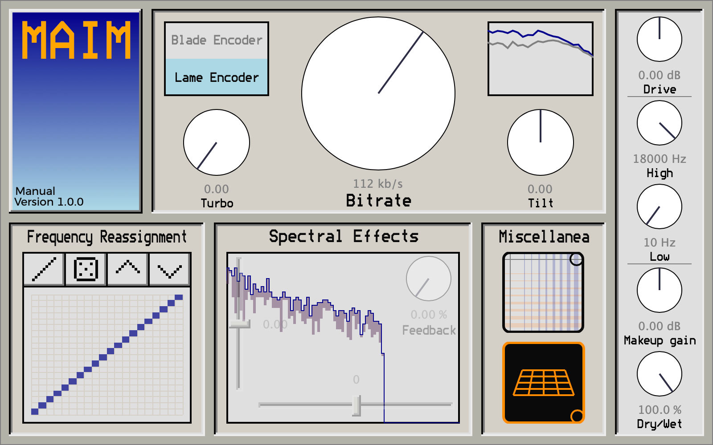
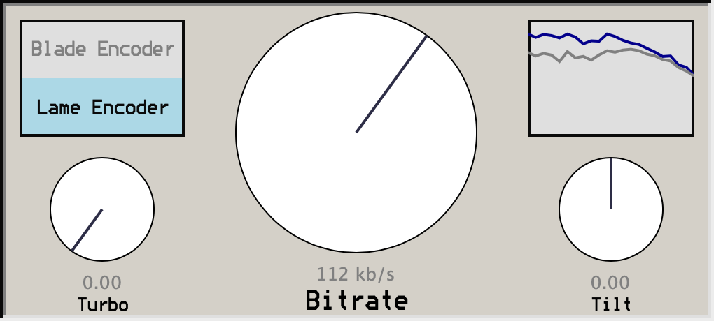
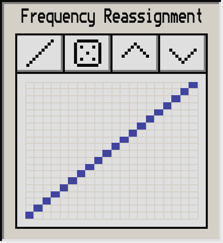
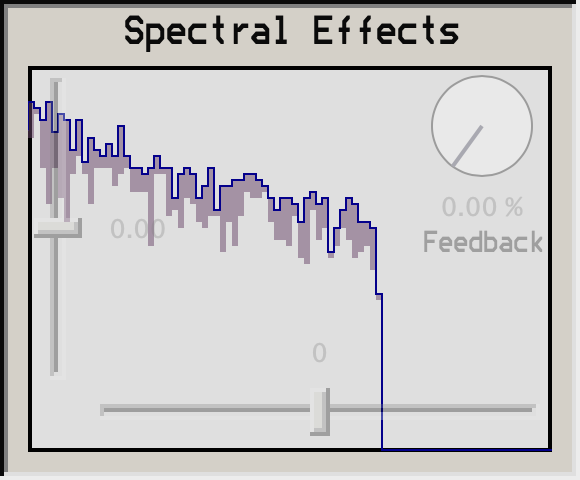
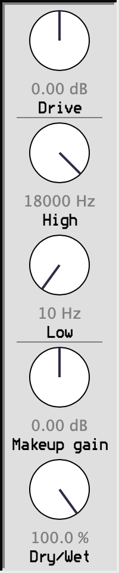

# MAIM User Manual

Few audio processes have been as celebrated and as derided as MP3 compression. From its birth in the '90s as a way to
shrink digital audio files small enough to send over the internet, it quickly became nearly synonymous with music
piracy. Through the 2000s and 2010s, it's reputation changed, and audiophiles and musicians bemoaned the quick and easy MP3
as indicative of a consumerist "McDonald's generation" of music listeners, unconcerned with audio quality. Now, as 
internet speeds and computer storage grows exponentially, the humble MP3 sinks farther into the realm of nostalgia,
joining the wow and flutter of tape and the crackle of vinyl as sounds that bring listeners back to a time and place. 

So what is this infamous sound of the MP3? MP3 files are able to be so much smaller than uncompressed digital audio 
thanks to "lossy" compression: information in the sound spectrum is selectively removed, to compress a track to a
certain number of bits per second. At high bitrates, the changes will be inaudible (though the exact bitrate at which
they become audible is, like every other audiophile topic, fiercely debated). Bring the bitrate down a bit, and the
audio takes on a shimmering, out-of-focus tone. Bring the bitrate down even further, and your track is fully at the
mercy of the MP3 encoder. All bets are off in this zone: the MP3 spec lets encoders decide *which* parts of the sound
to remove, so each encoder will have a different tone.

MAIM uses real encoders to get the utmost accurate MP3 sound. However, it also has a wide palette of controls to let you
turn the encoding process up to 11, or break it entirely. If an MP3 is a beautiful loaf of bread, MAIM lets you turn eat
it fresh with butter and honey... or make the baker watch as you turn it into a bread bowl

## The Encoder Controls

This panel controls the encoder settings, to get the full gamut of realistic MP3 encoding sounds.

### Blade Encoder / Lame Encoder

MAIM uses two MP3 encoders, each with a distinctive tone.

LAME (LAME Ain't an MP3 Encoder) is a professional and cosmopolitan encoder, with decades of design behind it for the 
least obtrusive tone. It can handle just about anything you throw at it, even notoriously difficult-to-encode tracks 
that confuse other encoders. Always the rebellious cool kid, LAME managed to sneak by patent regulations and deliver the 
best MP3 tone as a free open-source program. As it compresses to lower bitrates, LAME rolls off the high frequencies 
heavily, resulting in a muffled sound. 

Blade is a bit rougher around the edges, but even more endearing than LAME. Designed at the turn of the millennium by 
Tord Jansson, it has a vibrant, bubbly tone, washing out transients much more heavily than LAME does. Transport your 
tracks back to 2002, using this real-deal antique MP3 encoder. 

### Bitrate

The bitrate, measured in kilobits per second, controls how much memory your MP3 would take up. As in a bitcrusher, *lower*
numbers mean less bits which means *more* distortion.

### Turbo

If the current bitrate isn't cutting it, this knob forces the encoder to crush the sound even smaller.

### Tilt

This biases the encoder towards lower or higher frequencies. At 0, the encoder works as normal. At negative values, the
encoder is more inclined to keep low-frequency sounds and discard high-frequency sounds. 
At positive values, the encoder is more inclined to keep high-frequency sounds and discard low-frequency sounds. 

The graph above the tilt parameter shows the results: the blue line is the spectrum of the audio, and the gray line is
the threshold, calculated by the MP3 encoder's psychoacoustic model, below which noise is not noticeable at that 
frequency. As much as possible, MP3 encoders will only remove sounds that are below the gray line.

## Frequency Reassignment

After an MP3 encoder determines which frequencies should be compressed, the audio is converted to the frequency domain
for the actual compression. (The astute reader will note that this requires two transforms where one would do just
fine. The reasons for this are more political than mathematical. See Stephen Witt's excellent book *How Music Got Free*)
 
In this matrix, you can change which frequency gets mapped to each line: the columns correspond to the output lines,
and the rows correspond to the input lines. For instance, if you wanted the low frequency information to play across all
frequencies, you would set the highlighted squares to all be in the bottom row.

There are 4 buttons to help with more tedious tasks:

- Reset to the standard mapping
- Randomize the mapping
- Shift the mapping up by one tick
- Shift the mapping down by one tick

## Spectral Effects

### Horizontal Shift

This slider shifts the frequencies up or down, rotating around the end.

### Vertical Shift

Raising the slider above zero increases the amplitude of quiet frequencies, effectively adding noise to quieter parts of the 
frequency spectrum. Lowering the slider below zero removes the signal at quieter frequencies, giving the audio a bubbly,
chirping sound. This is a similar sound to high turbo settings, but generally with greater clarity.

### Feedback

This knob feeds the output of one spectrum frame back into the input of the next, for a buzzy resonance.

The background of this panel shows the spectrum of the input audio generated in the MP3 encoder. As you move the knobs
in this section, you will see two graphs: the orange one is the audio before these spectral effects, and the blue one is
the audio after.

## Miscellanea

These oddball effects were discovered by fishing around in the code of the MP3 encoders and trying out different "bends".

The top effect, which comes from the aliasing "butterfly" step of MP3 encoding, plays with constructive or destructive 
interference between neighboring bands in the frequency spectrum. By default, this box is set to the top right, which
is no distortion.

The bottom effect, which is only available in the LAME encoder, warps the way that the encoder steps through the samples
in creating the spectrum. By default, this box is set to the bottom right, which is no distortion.

## Sidebar

These are your standard tools for corralling audio effects:

### Drive

Drive is the amount by which the input signal is turned up or down before being passed to the encoder. If the levels are
above 0 dB after drive, there may be audible clipping. 

### High / Low

These are gentle biquad filters, applied after the MP3 compression.

### Makeup Gain

Makeup gain is the amount by which the signal coming out of the MP3 decoder is turned up or down before being passed to
the dry/wet control.

### Dry/Wet

The proportion of the sound that is dry (unprocessed input audio, delay-corrected to line up with the output) versus wet
(output from the MP3 compressor). At 0%, you will only hear the dry sound; at 100%, only the wet sound.